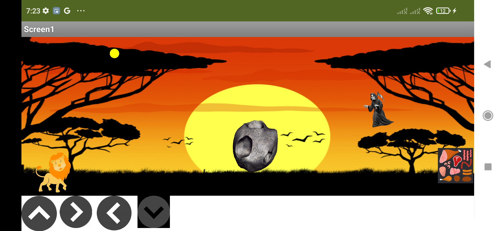
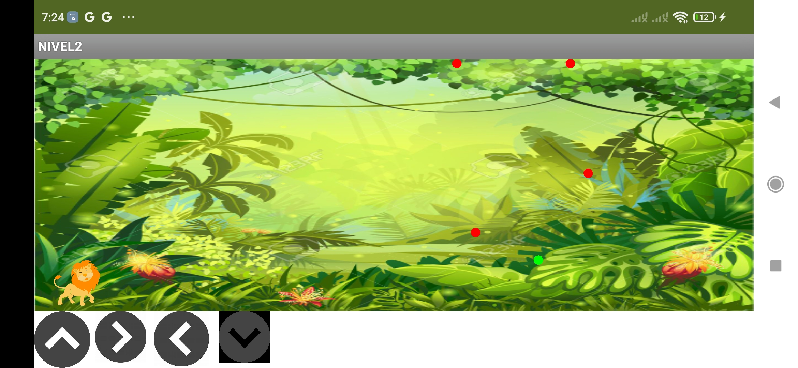
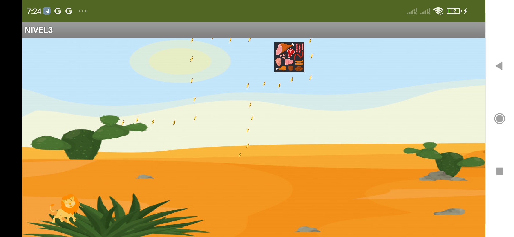
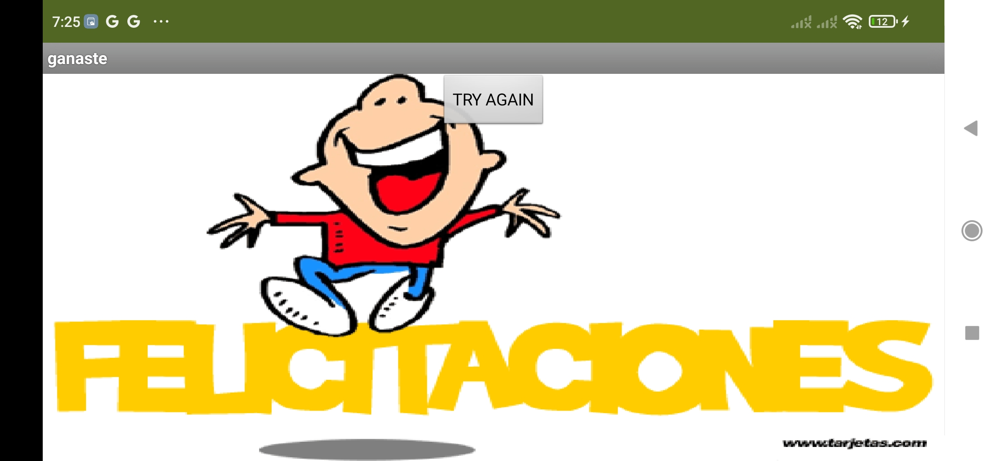
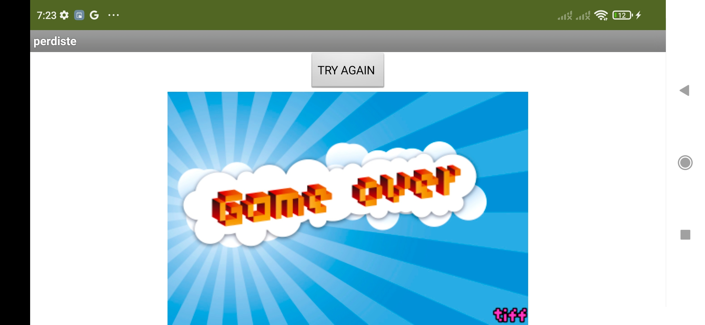

# 🎮 mini_game – 3-Level Game in MIT App Inventor

**`mini_game`** is a mobile game developed using **MIT App Inventor** that challenges players to complete **three levels**, each increasing in difficulty. If the player beats all levels, they’re shown a **"Congratulations"** screen. If they fail at any level, they’ll see a **"Game Over"** screen—with the option to **restart from Level 1**.

This game was built as part of my learning journey in app development, focusing on screen logic, condition handling, and user experience design.

---

## 💡 Features
- 🕹️ **Three interactive levels** with increasing difficulty
- 🎉 **Congratulations screen** after completing all levels
- ❌ **Game Over screen** if the player fails any level
- 🔁 **Restart button** brings the user back to Level 1
- 🎨 UI built using MIT App Inventor's screen system

---

## 🛠️ Built With
- [MIT App Inventor](https://appinventor.mit.edu/)
- MIT AI2 Companion (for testing)
- Android smartphone (for gameplay)

---

## 🚀 How to Play
1. Open [MIT App Inventor](https://ai2.appinventor.mit.edu/)
2. Go to **Projects > Import project (.aia) from my computer**
3. Upload the `mini_game.aia` file from this repository
4. Use the **MIT AI2 Companion** to test the app, or build and install the `.apk` on your phone
5. Try to beat all 3 levels without failing!

---

## 📸 Screenshots

**Level 1 Gameplay**  

**Level 2 Gameplay**  

**Level 3 Gameplay**  

**Congratulations Screen**  

**Game Over Screen**  

> 📝 Make sure these image files are uploaded with these exact names to display correctly.

---

## 🧠 What I Learned
- Designing multi-level game logic using block-based programming
- Managing navigation between screens in MIT App Inventor
- Providing meaningful feedback with win and fail states
- Creating a polished, complete game experience

---

## 📫 Contact
- 📧 iandanielalfon@gmail.com  
- 🔗 [LinkedIn – Ian Alfonso](https://www.linkedin.com/in/ianalfonso)

---

🙌 Thanks for checking out **mini_game**! Feel free to try it, fork it, or leave feedback!
